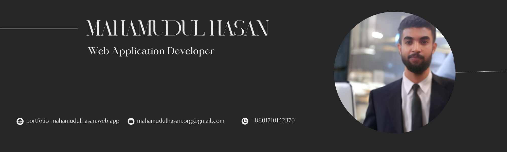

  

# 𝐇𝐞𝐲 𝐭𝐡𝐞𝐫𝐞, 𝐈'𝐦 𝐌𝐚𝐡𝐚𝐦𝐮𝐝𝐮𝐥 𝐇𝐚𝐬𝐚𝐧! 

I'm a Web Application Developer. I spend most of my time coding and love to create new applications.

## 𝐂𝐨𝐧𝐧𝐞𝐜𝐭 𝐰𝐢𝐭𝐡 𝐦𝐞 

## 𝐀𝐛𝐨𝐮𝐭 𝐌𝐞

:hearts: I enjoy programming and love to learn new things.  
:computer: I'm currently learning <strong>Next.js.</strong>  
🌍 To see my portfolio and latest projects visit [mahamudulhasan.me](https://portfolio-mahamudulhasan.web.app/).  
📧 How to reach me: mahamudulhasan.org@gmail.com  
🌿 Fun fact: I love to read books and write stories, and I also spend some time in my little garden.

## ⚙️ 𝐓𝐞𝐜𝐡𝐧𝐨𝐥𝐨𝐠𝐢𝐞𝐬 𝐈 𝐜𝐨𝐝𝐞 𝐰𝐢𝐭𝐡

  
<h4>Want to know more about me?</h4>

   
  I am a student of Computer Science and Engineering at Dhaka International University. I love programming and am very interested in new technologies.
  
  Visit my [portfolio](https://portfolio-mahamudulhasan.web.app/) to learn more about my work.
  
  #### Github Stats
  

